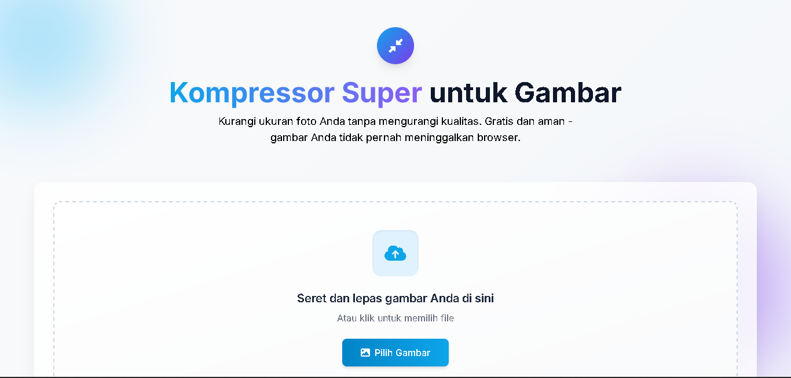

# 🖼️ Kompressor Super - Image Compressor



## 🔥 Apa itu Kompressor Super?

Yo! Ini adalah tool super keren buat kompres gambar kamu langsung di browser. Nggak perlu upload ke server, semua proses langsung di device kamu. Aman, cepet, dan pastinya FREE! 

### ✨ Fitur Unggulan

- 🚀 Kompres gambar tanpa mengorbankan kualitas
- 🔒 100% aman - semua proses di browser lokal
- 🎯 Support format JPEG, PNG, GIF, dan WEBP
- 📐 Resize gambar sesuai kebutuhan
- 🎨 Atur kualitas output (10-100%)
- 💾 Download hasil kompresi langsung
- 📋 Copy ke clipboard dengan 1 klik
- 🌈 UI yang clean dan responsive

## 🚀 Cara Pakai

1. Buka [Kompressor Super](https://yourwebsite.com)
2. Drag & drop gambar atau klik "Pilih Gambar"
3. Atur setting sesuai kebutuhan:
   - Kualitas output
   - Format output
   - Ukuran baru (opsional)
4. Klik "Kompres Gambar"
5. Download hasil 🎉

## 💻 Tech Stack

- HTML5
- TailwindCSS
- JavaScript (Vanilla)
- Font Awesome
- Web APIs (File, Canvas, Clipboard)

## 🛠️ Development

Mau kontribusi? Gas! 

```bash
# Clone repo
git clone https://github.com/yourusername/IMG-Compressor.git

# Buka folder
cd IMG-Compressor

# Jalanin di local server
# Bisa pake Live Server di VS Code atau
python -m http.server 8000
```

## 📝 Limitasi

- Max 20 gambar per proses
- Max size 50MB per gambar
- Fitur ZIP di versi premium

## 🤝 Kontribusi

Feel free untuk:
- Fork repo ini
- Bikin branch baru
- Commit changes
- Push ke branch
- Bikin Pull Request

## 📜 License

MIT License - feel free to use! 

## 🙏 Credits

Created with ❤️ by [YoshCasaster](https://github.com/YoshCasaster)

---
### 🌟 Support Project Ini
Kalo project ini membantu, kasih bintang ya! ⭐

[⬆ back to top](#kompressor-super---image-compressor)